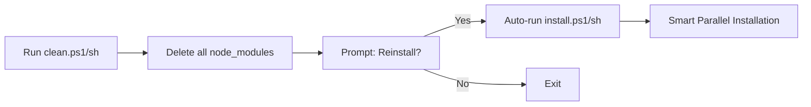

## Overview

The TailStack clean scripts (`clean.ps1` and `clean.sh`) are high-performance cleanup utilities designed to completely purge `node_modules` directories and `pnpm-lock.yaml` files from your entire monorepo. These scripts employ parallel processing, brutal verification loops, and process killing to handle even the most stubborn file locks.

## Key Features

<CardGroup cols={2}>
  <Card title="Parallel Execution" icon="bolt">
    Uses system threads (PowerShell Runspaces / Bash xargs) to delete multiple directories simultaneously
  </Card>
  <Card title="Retry Logic" icon="rotate">
    3-phase verification system with automatic retries for locked files
  </Card>
  <Card title="Process Termination" icon="skull">
    Automatically kills Node.js and VS Code processes that lock files
  </Card>
  <Card title="Interactive Handoff" icon="hand">
    Optional prompt to immediately run fresh installation after cleanup
  </Card>
</CardGroup>

## How It Works

The clean script operates in three distinct phases:

### Phase 1: Initial Nuke

1. **Scanning**: Recursively discovers all `node_modules` directories and `pnpm-lock.yaml` files
2. **Parallel Deletion**: Uses maximum CPU threads (CPU count × 2) to delete targets simultaneously
3. **Progress Tracking**: Displays real-time deletion progress

### Phase 2: Brutal Verification Loop

1. **Survivor Scan**: Checks for any remaining `node_modules` directories
2. **Process Killing**: Terminates Node.js and VS Code processes that may be locking files
3. **Retry Attempts**: Up to 3 retry cycles with forced deletion
4. **Escalation**: Uses OS-level commands (`cmd /c rd` on Windows, `rm -rf` on Unix)

### Phase 3: Handoff

1. **Completion Report**: Shows total execution time
2. **Interactive Prompt**: Asks if you want to run a fresh installation
3. **Auto-Launch**: Optionally triggers `install.ps1` or `install.sh`

## Usage

<Tabs>
  <Tab title="PowerShell">
    <CodeGroup>
    ```powershell Windows (PowerShell)
    # From repository root
    .\scripts\clean.ps1
    ```
    
    ```powershell With Admin Rights
    # Run as Administrator for stubborn locks
    Start-Process powershell -Verb RunAs -ArgumentList "-File .\scripts\clean.ps1"
    ```
    </CodeGroup>
    
    <Info>
    **First run?** You may need to enable script execution:
    ```powershell
    Set-ExecutionPolicy -Scope CurrentUser -ExecutionPolicy RemoteSigned
    ```
    </Info>
  </Tab>
  
  <Tab title="Shell">
    <CodeGroup>
    ```bash Linux/macOS
    # From repository root
    ./scripts/clean.sh
    ```
    
    ```bash Make Executable (First Time)
    chmod +x ./scripts/clean.sh
    ./scripts/clean.sh
    ```
    </CodeGroup>
    
    <Info>
    The script works on both Linux and macOS, automatically detecting CPU count using `nproc` or `sysctl`.
    </Info>
  </Tab>
</Tabs>

## Performance Characteristics

<AccordionGroup>
  <Accordion title="Execution Speed">
    **Typical Performance:**
    - Small monorepo (5-10 packages): 2-5 seconds
    - Medium monorepo (20-50 packages): 5-15 seconds
    - Large monorepo (100+ packages): 15-45 seconds
    
    Speed depends on:
    - Number of `node_modules` directories
    - Total file count in dependencies
    - Disk I/O speed (SSD vs HDD)
    - Antivirus interference (Windows)
  </Accordion>
  
  <Accordion title="Parallel Processing">
    The script calculates optimal thread count:
    ```
    Max Threads = CPU Logical Cores × 2
    ```
    
    **Example:**
    - 4-core CPU (8 threads) → 16 parallel deletions
    - 8-core CPU (16 threads) → 32 parallel deletions
    - 16-core CPU (32 threads) → 64 parallel deletions
  </Accordion>
  
  <Accordion title="Retry Mechanism">
    If files survive initial deletion:
    
    1. **Retry 1**: Kill Node/VS Code processes, re-delete
    2. **Retry 2**: Force deletion with OS commands
    3. **Retry 3**: Final attempt with all escalations
    
    After 3 retries, remaining locks are reported for manual intervention.
  </Accordion>
</AccordionGroup>

## Output Examples

<Tabs>
  <Tab title="Successful Cleanup">
    ```ansi
    [35m--- LIGHTNING PNPM PURGE: NO MERCY EDITION ---[0m
    [36m[1/3] Scanning for targets...[0m
    [33mFound 47 items. Starting Parallel Nuke...[0m
    [33mRunning Phase 1: Initial Purge on 47 items with 16 threads...[0m
    [36m[2/3] Verifying cleanup integrity...[0m
    [32mVerification Passed: All node_modules purged.[0m
    [32m[3/3] Process finished in 8.42s.[0m
    
    [36mWould you like to trigger a fresh reinstallation? (Y/N)[0m
    ```
  </Tab>
  
  <Tab title="With Retries">
    ```ansi
    [35m--- LIGHTNING PNPM PURGE: NO MERCY EDITION ---[0m
    [36m[1/3] Scanning for targets...[0m
    [33mFound 23 items. Starting Parallel Nuke...[0m
    [36m[2/3] Verifying cleanup integrity...[0m
    [31m[!] ALERT: 3 folders survived! (Retry 1/3)[0m
    [31m[!] Escalating: Killing Node/VS Code to release file locks...[0m
    [33mRunning Phase 2: Brutal Retry 1 on 3 items with 16 threads...[0m
    [32mVerification Passed: All node_modules purged.[0m
    [32m[3/3] Process finished in 12.18s.[0m
    ```
  </Tab>
</Tabs>

## Troubleshooting

<Warning>
**The script terminates Node.js and VS Code processes during retry phases.** Save your work before running if you have unsaved files.
</Warning>

### Common Issues

<AccordionGroup>
  <Accordion title="Permission Denied Errors">
    **Windows:**
    ```powershell
    # Run PowerShell as Administrator
    Start-Process powershell -Verb RunAs
    ```
    
    **Linux/macOS:**
    ```bash
    # Ensure script is executable
    chmod +x ./scripts/clean.sh
    
    # If still failing, check file ownership
    sudo chown -R $USER:$USER .
    ```
  </Accordion>
  
  <Accordion title="Files Still Locked After 3 Retries">
    Manual intervention steps:
    
    1. **Close all editors and terminals**
    2. **Windows**: Use Process Explorer to find locking processes
    3. **Linux/macOS**: Use `lsof` to identify locks:
       ```bash
       lsof +D ./node_modules
       ```
    4. **Reboot** as last resort (releases all file locks)
  </Accordion>
  
  <Accordion title="Antivirus Interference (Windows)">
    Windows Defender or third-party antivirus may slow deletion:
    
    1. **Add exclusion** for your project directory
    2. **Temporarily disable** real-time scanning
    3. **Check** antivirus logs for quarantined files
  </Accordion>
</AccordionGroup>

## What Gets Deleted

The script targets:

- `**/node_modules/` - All dependency directories (nested included)
- `**/pnpm-lock.yaml` - Lock files at any depth

**Preserved files:**
- `package.json` files (metadata preserved)
- `.npmrc` and `.pnpmfile.cjs` (configuration preserved)
- Source code and other project files

## Integration with Install Script

The clean script seamlessly integrates with the install script:



<Info>
Pressing **Y** at the prompt automatically launches the [install script](/automation/install-script) for a fresh dependency installation.
</Info>

## Technical Implementation

### PowerShell Architecture

```powershell Key Components
# Runspace pool for parallel execution
$Pool = [RunspaceFactory]::CreateRunspacePool(1, $MaxThreads)

# CMD-based deletion (faster than Remove-Item)
$NukeAction = {
    param($Path)
    cmd /c "rd /s /q `"$Path`"" 2>&1
}

# Process termination
Get-Process -Name "node", "Code" | Stop-Process -Force
```

### Shell Script Architecture

```bash Key Components
# xargs for parallel execution (equivalent to Runspaces)
cat "$targets_file" | xargs -P "$max_threads" -I {} rm -rf "{}"

# Process termination
pkill -f "node" > /dev/null 2>&1 || true
pkill -f "Code" > /dev/null 2>&1 || true

# CPU detection
cpu_count=$(nproc)  # Linux
cpu_count=$(sysctl -n hw.ncpu)  # macOS
```

## Best Practices

<Steps>
  <Step title="Commit Your Changes">
    Always commit or stash changes before running clean scripts.
  </Step>
  
  <Step title="Close Editors">
    Close VS Code and other IDEs to avoid file lock conflicts.
  </Step>
  
  <Step title="Check Disk Space">
    Clean scripts can free 1-10 GB depending on monorepo size.
  </Step>
  
  <Step title="Use After Dependency Issues">
    Run clean when experiencing:
    - Module resolution errors
    - Conflicting peer dependencies
    - Corrupted package caches
  </Step>
</Steps>

## Related Documentation

<CardGroup cols={2}>
  <Card title="Install Script" icon="download" href="/automation/install-script">
    Learn about parallel installation with load monitoring
  </Card>
  <Card title="Custom Scripts" icon="code" href="/automation/custom-scripts">
    Create your own automation scripts for the monorepo
  </Card>
</CardGroup>