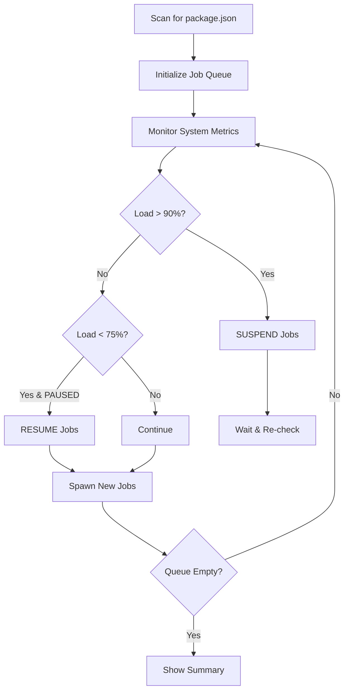

## Overview

The TailStack install scripts (`install.ps1` and `install.sh`) are production-grade orchestration utilities that manage parallel PNPM installations across your entire monorepo. Unlike simple `pnpm install -r`, these scripts intelligently monitor system resources and dynamically adjust concurrency to prevent system crashes.

## Key Features

<CardGroup cols={2}>
  <Card title="Smart Parallelization" icon="gears">
    Dynamically adjusts concurrent installations based on real-time CPU and RAM usage
  </Card>
  <Card title="Load Monitoring" icon="gauge">
    Continuously monitors system metrics to prevent resource exhaustion
  </Card>
  <Card title="Automatic Throttling" icon="pause">
    Suspends jobs when system load exceeds thresholds, resumes when safe
  </Card>
  <Card title="State Machine Architecture" icon="diagram-project">
    Robust RUNNING/PAUSED state management with hysteresis loops
  </Card>
</CardGroup>

## How It Works

### System Architecture

The install script implements a sophisticated orchestration loop:



### Three-State System

<Tabs>
  <Tab title="RUNNING State">
    **Active Processing Mode**
    
    - Spawns new jobs based on available resources
    - Dynamic concurrency: `Floor(Cores × (1 - CPU/100))`
    - Minimum 1 job, maximum = logical cores
    - Monitors RAM: pauses if < 500MB free
    
    **Transitions:**
    - → PAUSED when CPU or RAM exceeds 90%
  </Tab>
  
  <Tab title="PAUSED State">
    **Load Protection Mode**
    
    - Suspends all active jobs (SIGSTOP on Unix, thread suspension on Windows)
    - Prevents new job spawning
    - Continues monitoring system load
    - Jobs remain in memory but consume no CPU
    
    **Transitions:**
    - → RUNNING when both CPU and RAM drop below 75%
  </Tab>
  
  <Tab title="COMPLETED State">
    **Final Summary**
    
    - All jobs finished (success or failure)
    - Queue empty
    - Displays success/failure counts
    - Exit with appropriate code
  </Tab>
</Tabs>

## Usage

<Tabs>
  <Tab title="PowerShell">
    <CodeGroup>
    ```powershell Basic Usage
    # From repository root
    .\scripts\install.ps1
    ```
    
    ```powershell After Clean Script
    # Automatically launched by clean.ps1
    .\scripts\clean.ps1
    # Press 'Y' when prompted
    ```
    
    ```powershell Manual Invocation
    # Explicit path
    & "$PSScriptRoot\scripts\install.ps1"
    ```
    </CodeGroup>
    
    <Info>
    **Requirements:**
    - PowerShell 5.1+ (Windows) or PowerShell Core 7+ (cross-platform)
    - PNPM installed and in PATH
    - Windows: CIM/WMI access for system monitoring
    </Info>
  </Tab>
  
  <Tab title="Shell">
    <CodeGroup>
    ```bash Basic Usage
    # From repository root
    ./scripts/install.sh
    ```
    
    ```bash After Clean Script
    # Automatically launched by clean.sh
    ./scripts/clean.sh
    # Press 'y' when prompted
    ```
    
    ```bash Background Execution
    # Run in background with output log
    nohup ./scripts/install.sh > install.log 2>&1 &
    ```
    </CodeGroup>
    
    <Info>
    **Requirements:**
    - Bash 4.0+ (Linux) or Bash 3.2+ (macOS)
    - PNPM installed and in PATH
    - Access to `/proc/stat` and `/proc/meminfo` (Linux) or `sysctl` (macOS)
    </Info>
  </Tab>
</Tabs>

## Load Monitoring System

### Metrics Collection

The script monitors two critical metrics:

<CardGroup cols={2}>
  <Card title="CPU Usage" icon="microchip">
    **Measurement:**
    - Windows: `Win32_Processor.LoadPercentage` via CIM
    - Linux/macOS: `/proc/stat` delta calculation
    
    **Update Frequency:** Every 1 second
  </Card>
  
  <Card title="RAM Usage" icon="memory">
    **Measurement:**
    - Windows: `Win32_OperatingSystem` memory counters
    - Linux: `/proc/meminfo` MemAvailable
    - macOS: `vm_stat` equivalent
    
    **Update Frequency:** Every 1 second
  </Card>
</CardGroup>

### Threshold System

<AccordionGroup>
  <Accordion title="Critical Threshold (90%)">
    **Triggers:** System enters PAUSED state
    
    **Actions:**
    1. All running jobs receive suspend signal
    2. No new jobs spawn
    3. Dashboard shows "PAUSED" status
    
    **Rationale:**
    Prevents system from becoming unresponsive due to excessive load. Jobs are suspended (not killed) to preserve progress.
  </Accordion>
  
  <Accordion title="Safe Threshold (75%)">
    **Triggers:** System returns to RUNNING state
    
    **Actions:**
    1. All suspended jobs receive resume signal
    2. New jobs can spawn based on dynamic limits
    3. Dashboard shows "RUNNING" status
    
    **Rationale:**
    Hysteresis (75% resume vs 90% pause) prevents rapid state oscillation.
  </Accordion>
  
  <Accordion title="Dynamic Concurrency">
    **Formula:**
    ```
    Remaining Capacity = 100 - Current CPU Usage
    Dynamic Limit = Floor(Logical Cores × Remaining Capacity / 100)
    Minimum Limit = 1
    ```
    
    **Example (8-core system):**
    - CPU at 20% → 8 × 0.80 = 6 concurrent jobs
    - CPU at 50% → 8 × 0.50 = 4 concurrent jobs
    - CPU at 80% → 8 × 0.20 = 1 concurrent job
  </Accordion>
</AccordionGroup>

## Output Examples

<Tabs>
  <Tab title="Normal Operation">
    ```ansi
    [36m---  PNPM ORCHESTRATOR ---[0m
    Scanning for package.json...[32m Found 23 projects.[0m
    -> Start: packages/api
    -> Start: packages/web
    -> Start: packages/mobile
    
    [35m[PNPM Orchestrator (RUNNING)] CPU: 45% | RAM: 62% | Active: 3 | Queued: 20 | Progress: 13%[0m
    
    [32m[Success] /home/user/project/packages/api[0m
    
    -> Start: packages/shared
    
    [35m[PNPM Orchestrator (RUNNING)] CPU: 52% | RAM: 68% | Active: 3 | Queued: 17 | Progress: 26%[0m
    ```
  </Tab>
  
  <Tab title="High Load Scenario">
    ```ansi
    [35m[PNPM Orchestrator (RUNNING)] CPU: 88% | RAM: 85% | Active: 6 | Queued: 12 | Progress: 47%[0m
    
    [33m[WARN] High Load (CPU:91% RAM:87%). Suspending...[0m
    
    [35m[PNPM Orchestrator (PAUSED)] CPU: 91% | RAM: 87% | Active: 6 | Queued: 12 | Progress: 47%[0m
    [35m[PNPM Orchestrator (PAUSED)] CPU: 89% | RAM: 84% | Active: 6 | Queued: 12 | Progress: 47%[0m
    [35m[PNPM Orchestrator (PAUSED)] CPU: 78% | RAM: 76% | Active: 6 | Queued: 12 | Progress: 47%[0m
    [35m[PNPM Orchestrator (PAUSED)] CPU: 72% | RAM: 71% | Active: 6 | Queued: 12 | Progress: 47%[0m
    
    [36m[INFO] Load Normalized. Resuming...[0m
    
    [35m[PNPM Orchestrator (RUNNING)] CPU: 68% | RAM: 69% | Active: 6 | Queued: 12 | Progress: 47%[0m
    ```
  </Tab>
  
  <Tab title="Completion Summary">
    ```ansi
    [35m[PNPM Orchestrator (RUNNING)] CPU: 32% | RAM: 58% | Active: 0 | Queued: 0 | Progress: 100%[0m
    
    [36m--- SUMMARY ---[0m
    [32mSuccessful: 22[0m
    [31mFailed:     1[0m
    ```
  </Tab>
</Tabs>

## Advanced Features

### Job Suspension (Process Control)

<Tabs>
  <Tab title="Windows Implementation">
    **C# Interop with kernel32.dll**
    
    ```csharp Native Thread Control
    [DllImport("kernel32.dll")]
    public static extern IntPtr OpenThread(int dwDesiredAccess, 
        bool bInheritHandle, int dwThreadId);
    
    [DllImport("kernel32.dll")]
    public static extern int SuspendThread(IntPtr hThread);
    
    [DllImport("kernel32.dll")]
    public static extern int ResumeThread(IntPtr hThread);
    ```
    
    **PowerShell Usage:**
    ```powershell
    function Suspend-JobTree ($ProcessObject) {
        foreach ($thread in $ProcessObject.Threads) {
            $hThread = [ProcControl]::OpenThread(0x0002, $false, $thread.Id)
            [ProcControl]::SuspendThread($hThread) | Out-Null
            [ProcControl]::CloseHandle($hThread) | Out-Null
        }
    }
    ```
    
    <Info>
    Windows implementation suspends individual threads, preserving process state perfectly. Memory remains allocated but CPU consumption drops to zero.
    </Info>
  </Tab>
  
  <Tab title="Unix Implementation">
    **POSIX Signal Control**
    
    ```bash Process Group Suspension
    suspend_job() {
        local pid=$1
        if kill -0 "$pid" 2>/dev/null; then
            # SIGSTOP suspends the entire process group
            kill -SIGSTOP "$pid" 2>/dev/null || true
        fi
    }
    
    resume_job() {
        local pid=$1
        if kill -0 "$pid" 2>/dev/null; then
            # SIGCONT resumes the process group
            kill -SIGCONT "$pid" 2>/dev/null || true
        fi
    }
    ```
    
    <Info>
    Unix implementation uses signals sent to process groups, ensuring child processes (spawned by PNPM) are also suspended/resumed.
    </Info>
  </Tab>
</Tabs>

### Crash Prevention

<Warning>
**Why standard `pnpm install -r` can crash your system:**

1. Spawns all installations simultaneously
2. No resource monitoring
3. Can exceed available RAM (OOM killer)
4. Maxes out CPU (system becomes unresponsive)
5. No graceful degradation
</Warning>

The TailStack install scripts solve these issues:

- ✅ **Dynamic concurrency** based on actual load
- ✅ **Automatic throttling** prevents resource exhaustion
- ✅ **Job suspension** instead of termination
- ✅ **Progress preservation** during pauses
- ✅ **Predictable behavior** with state machine

## Performance Characteristics

<AccordionGroup>
  <Accordion title="Execution Speed">
    **Typical Performance (vs sequential):**
    
    | Packages | Sequential | Parallel Script | Speedup |
    |----------|-----------|----------------|----------|
    | 5-10     | 2-5 min   | 30-60 sec      | 3-5×     |
    | 10-30    | 5-15 min  | 1-3 min        | 4-6×     |
    | 30-100   | 15-45 min | 3-8 min        | 5-7×     |
    
    **Factors affecting speed:**
    - Network latency (package downloads)
    - Shared dependencies (PNPM store hits)
    - System specs (CPU cores, RAM, disk I/O)
    - Background load (other applications)
  </Accordion>
  
  <Accordion title="Resource Consumption">
    **CPU Usage:**
    - Startup: 20-40% (scanning phase)
    - Active: 60-90% (installation phase)
    - Throttled: 40-60% (dynamic adjustment)
    - PAUSED: 10-20% (monitoring only)
    
    **RAM Usage:**
    - Per job: 100-300 MB average
    - Concurrent jobs: 1-3 GB total
    - Safety margin: 500 MB minimum free
    - Peak: Typically 60-80% of total RAM
  </Accordion>
  
  <Accordion title="Scalability">
    **System Requirements:**
    
    | Monorepo Size | Min RAM | Min CPU | Recommended |
    |--------------|---------|---------|-------------|
    | Small (5-10) | 4 GB    | 2 cores | 8 GB, 4 cores |
    | Medium (30)  | 8 GB    | 4 cores | 16 GB, 8 cores |
    | Large (100+) | 16 GB   | 8 cores | 32 GB, 16 cores |
    
    The script automatically adapts to available resources.
  </Accordion>
</AccordionGroup>

## Troubleshooting

<AccordionGroup>
  <Accordion title="Installation Failures">
    **Check Summary Output:**
    ```ansi
    [31mFailed:     3[0m
    ```
    
    **Common Causes:**
    1. **Network errors**: Retry or check firewall
    2. **Peer dependency conflicts**: Check package.json
    3. **Insufficient disk space**: Clear PNPM store
    4. **Corrupted cache**: Run clean script first
    
    **Manual fix:**
    ```bash
    # Navigate to failed package
    cd packages/failed-package
    
    # Try installation with verbose logging
    pnpm install --loglevel=debug
    ```
  </Accordion>
  
  <Accordion title="Script Hangs or Freezes">
    **Symptoms:**
    - Dashboard stops updating
    - Progress stuck at same percentage
    - System responsive but script unresponsive
    
    **Solutions:**
    
    **1. Interrupt gracefully (Bash):**
    ```bash
    # Press Ctrl+C
    # Script kills all background jobs automatically
    ```
    
    **2. Force termination:**
    ```powershell
    # PowerShell: Kill script process
    Stop-Process -Name powershell -Force
    ```
    
    ```bash
    # Bash: Kill script and children
    pkill -f "install.sh"
    ```
  </Accordion>
  
  <Accordion title="PNPM Not Found Error">
    **Error Message:**
    ```
    pnpm is not found in PATH. Please install Node/PNPM first.
    ```
    
    **Solutions:**
    
    **Install PNPM globally:**
    ```bash
    npm install -g pnpm
    ```
    
    **Verify installation:**
    ```bash
    pnpm --version
    ```
    
    **Add to PATH (if needed):**
    ```bash
    # Add to ~/.bashrc or ~/.zshrc
    export PATH="$HOME/.local/share/pnpm:$PATH"
    ```
  </Accordion>
  
  <Accordion title="Permission Errors">
    **Windows:**
    ```powershell
    # Enable script execution
    Set-ExecutionPolicy -Scope CurrentUser -ExecutionPolicy RemoteSigned
    ```
    
    **Linux/macOS:**
    ```bash
    # Make script executable
    chmod +x ./scripts/install.sh
    
    # Fix ownership if needed
    sudo chown -R $USER:$USER .
    ```
  </Accordion>
</AccordionGroup>

## Best Practices

<Steps>
  <Step title="Run After Clean">
    Always run clean script before install for best results:
    ```bash
    ./scripts/clean.sh
    # Press 'y' to auto-launch install
    ```
  </Step>
  
  <Step title="Close Resource-Heavy Apps">
    Free up system resources before installation:
    - Close browsers with many tabs
    - Pause video streaming
    - Exit Docker containers
    - Stop development servers
  </Step>
  
  <Step title="Monitor First Run">
    Watch the dashboard during first run to understand system behavior:
    - Note typical CPU/RAM usage
    - Observe pause/resume cycles
    - Check completion time as baseline
  </Step>
  
  <Step title="Use in CI/CD Carefully">
    CI environments may need adjustments:
    ```yaml
    # GitHub Actions example
    - name: Install dependencies
      run: ./scripts/install.sh
      timeout-minutes: 30
    ```
    
    Consider using standard PNPM in CI (predictable resources):
    ```yaml
    - run: pnpm install --frozen-lockfile
    ```
  </Step>
</Steps>

## Technical Implementation

### State Machine Logic

```typescript State Transitions (Pseudo-code)
while (queue.length > 0 || running.length > 0) {
  metrics = getSystemMetrics();
  cleanupFinishedJobs();
  
  // Hysteresis: different thresholds for pause vs resume
  if (metrics.cpu >= 90 || metrics.ram >= 90) {
    if (state !== 'PAUSED') {
      suspendAllJobs();
      state = 'PAUSED';
    }
  } else if (metrics.cpu <= 75 && metrics.ram <= 75) {
    if (state === 'PAUSED') {
      resumeAllJobs();
      state = 'RUNNING';
    }
  }
  
  if (state === 'RUNNING') {
    dynamicLimit = calculateConcurrency(metrics, cores);
    spawnJobsUpToLimit(dynamicLimit);
  }
  
  updateDashboard(metrics, state);
  sleep(1000);
}
```

### Metrics Collection

<CodeGroup>
```powershell PowerShell (CIM)
function Get-Metrics {
    $os = Get-CimInstance Win32_OperatingSystem
    $proc = Get-CimInstance Win32_Processor
    
    $totalRam = $os.TotalVisibleMemorySize  # KB
    $freeRam = $os.FreePhysicalMemory       # KB
    $ramUsage = 100 - [math]::Round(($freeRam / $totalRam) * 100)
    
    return @{
        CpuUsage  = [math]::Round($proc.LoadPercentage)
        RamUsage  = $ramUsage
        FreeRamMB = [math]::Round($freeRam / 1024)
    }
}
```

```bash Bash (/proc)
get_metrics() {
    # RAM usage from /proc/meminfo
    mem_total_kb=$(grep MemTotal /proc/meminfo | awk '{print $2}')
    mem_avail_kb=$(grep MemAvailable /proc/meminfo | awk '{print $2}')
    
    used_kb=$((mem_total_kb - mem_avail_kb))
    CURRENT_RAM=$(( (used_kb * 100) / mem_total_kb ))
    FREE_RAM_MB=$(( mem_avail_kb / 1024 ))
    
    # CPU usage from /proc/stat delta
    read -r cpu a1 b1 c1 d1 e1 f1 g1 rest < /proc/stat
    total1=$((a1 + b1 + c1 + d1 + e1 + f1 + g1))
    idle1=$d1
    
    sleep 0.1
    
    read -r cpu a2 b2 c2 d2 e2 f2 g2 rest < /proc/stat
    total2=$((a2 + b2 + c2 + d2 + e2 + f2 + g2))
    idle2=$d2
    
    total_delta=$((total2 - total1))
    idle_delta=$((idle2 - idle1))
    used_delta=$((total_delta - idle_delta))
    
    CURRENT_CPU=$(( (used_delta * 100) / total_delta ))
}
```
</CodeGroup>

## Related Documentation

<CardGroup cols={2}>
  <Card title="Clean Script" icon="trash" href="/automation/clean-script">
    Learn about the cleanup utility that pairs with install
  </Card>
  <Card title="Custom Scripts" icon="code" href="/automation/custom-scripts">
    Create your own automation scripts for the monorepo
  </Card>
  <Card title="Package Management" icon="box" href="/packages/package-management">
    Understand PNPM workspaces and dependency management
  </Card>
</CardGroup>